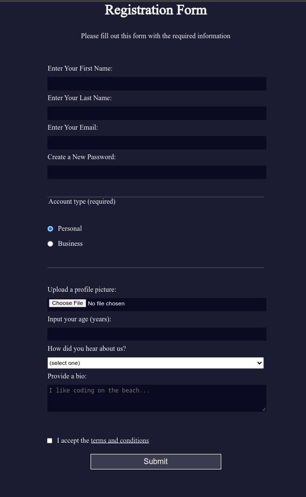

# ARCHIVED
As the new Curriculum is coming out, this repo will be considered as an legacy project. in the new Curriculum they may have changed some stuff, 

# Learn-html-forms-by-building-a-registration-form
A Flawless Registration Form from [FreeCodeCamp Responsive Web Design Course 2022 ](https://www.freecodecamp.org/learn/2022/responsive-web-design/#learn-html-forms-by-building-a-registration-form)

# Table Of Contents

* [Notice](#notice) - Notice From Yu14 Ywen
* [Documentations](#documentations) - DOcumentations for this repo
* [Screenshots](#screenshots) - Screenshots to show this Website

# Notice

**Please do not use this material to cheat on your school project or any sort related to education.** it is best if you learn and read resources so you will understand everything. Think of this as a template and take inspiration. Although, There are no restrictions that suspends you from forking it and using it for your own purposes.

[Back to Top](#Learn-html-forms-by-building-a-registration-form)

# Documentations

[Visit the website](https://yu14y.github.io/Learn-html-forms-by-building-a-registration-form/) 

Reminder, this is the 2022 course. i will not update to future courses. A registration form is from Freecodecamp Responsive Web Design Course. This Repo was created to showcase the website. I will not be explaining any html elements or any css code as i believe users may use this repo to finish the course quickly. I wish that you read all the resources first, so u will understand everything better and understand every part of it. This Repo was created since [Yu14 Ywen (the Owner of this Repo)](https://github.com/Yu14Y) was taking the course on Freecodecamp. I wish to remind you that. Everything in the index.html & styles.css file was the output of the course.

I will not be merging any PR related to index.html or styles.css but other PR that will improve the readme will be merged.

[Back to Top](#Learn-html-forms-by-building-a-registration-form)

# Screenshots

[Back to Top](#Learn-html-forms-by-building-a-registration-form)
